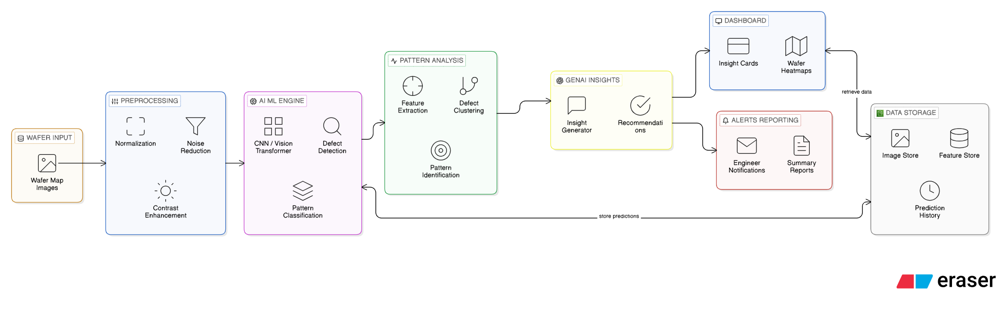
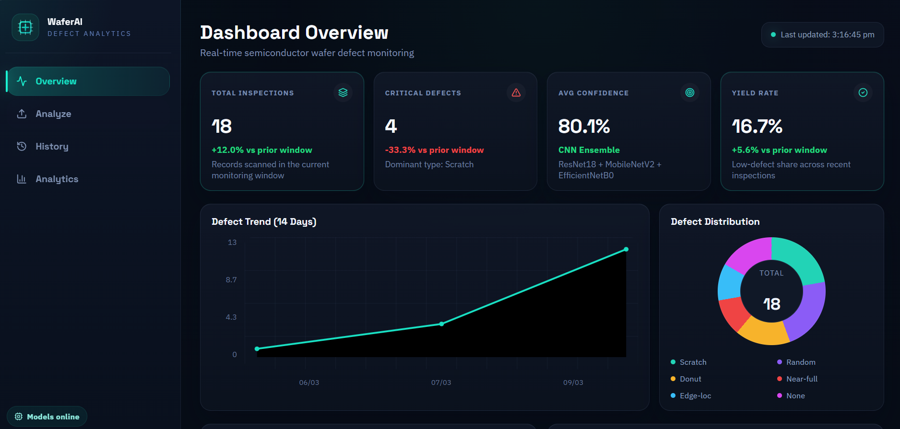

# WaferVision AI 🔬

WaferVision AI is a semiconductor wafer-defect inspection platform that combines a Python backend, a React dashboard, CNN-based defect classification, heatmap generation, MongoDB history tracking, AWS artifact storage, and Gemini-generated engineering insights.

It is designed to help inspect wafer images, monitor recent defect patterns, and identify whether a current defect is isolated or part of a broader manufacturing-process issue.

## Live Demo

Frontend: https://wafer-map-pattern-system.vercel.app/

## ✨ Highlights

- 🧠 CNN ensemble prediction using ResNet18, MobileNetV2, and EfficientNetB0
- 🔥 Heatmap generation for visual defect interpretation
- 📊 React dashboard with Overview, Analyze, History, and Analytics pages
- 🗂️ MongoDB-backed inspection history
- ☁️ Optional AWS S3 storage for uploaded images and heatmaps
- 🤖 Gemini insights for:
  - current wafer analysis
  - manufacturing process analysis using the last 30 to 40 wafers
- ⚡ FastAPI backend for frontend integration
- 🖥️ Streamlit dashboard retained for internal workflow and debugging

## 🏗️ Project Structure

```text
Wafer Map Pattern System/
├─ backend/
│  ├─ api/
│  ├─ app/
│  ├─ database/
│  ├─ models/
│  ├─ services/
│  ├─ main.py
│  └─ requirements.txt
├─ frontend/
│  ├─ src/
│  ├─ package.json
│  └─ vite.config.js
├─ requirements.txt
└─ test_pipeline.py
```

## 🧩 Architecture

### System Flow



### Backend

- `backend/api/main.py`: FastAPI routes used by the React frontend
- `backend/app/`: Streamlit app and Streamlit pages
- `backend/services/inference_service.py`: model loading, classification, heatmap generation
- `backend/services/gemini_service.py`: current-wafer and manufacturing-process insights
- `backend/services/mongo_service.py`: analysis persistence and history access
- `backend/services/aws_service.py`: optional S3 uploads
- `backend/database/mongodb.py`: MongoDB collection setup
- `backend/database/schema.py`: schema helper for saved wafer documents
- `backend/models/`: trained model files used by inference

### Frontend

- `frontend/src/App.jsx`: shell and route layout
- `frontend/src/pages/OverviewPage.jsx`: KPI and monitoring dashboard
- `frontend/src/pages/AnalyzePage.jsx`: upload, prediction, heatmap, and insights
- `frontend/src/pages/HistoryPage.jsx`: historical inspection review
- `frontend/src/pages/AnalyticsPage.jsx`: defect-distribution and process analytics

## 📱 Dashboard Pages

- `Overview` 📈: summary KPIs, severity charts, recent inspections, and trend monitoring
- `Analyze` 🧪: upload a wafer image and generate prediction, heatmap, and Gemini insights
- `History` 🕘: inspect stored records and artifact links
- `Analytics` 📊: analyze defect mix and process-level patterns

### Dashboard Preview



## 🧠 Model Training

The models used in this project were trained in Google Colab.

- Google Colab notebook: https://colab.research.google.com/drive/1V3XBRUfvEa-3m-sP53dmVoVTTbUUyglE?usp=sharing

## ⚙️ Prerequisites

- Python 3.11+
- Node.js 18+
- MongoDB
- Optional AWS S3 bucket
- Optional Gemini API key

## 📦 Python Dependencies

The root `requirements.txt` includes:

- `fastapi`
- `uvicorn[standard]`
- `streamlit`
- `torch`
- `torchvision`
- `numpy<2`
- `pillow`
- `ultralytics`
- `pymongo`
- `boto3`
- `google-genai`
- `python-multipart`
- `python-dotenv`

## 🔐 Environment Variables

Create `backend/.env`:

```env
MONGO_URI=
DATABASE_NAME=
COLLECTION_NAME=

GEMINI_API_KEY=

AWS_ACCESS_KEY_ID=
AWS_SECRET_ACCESS_KEY=
AWS_REGION=
AWS_BUCKET=
AWS_S3_PREFIX=

CORS_ORIGINS=http://localhost:5173,http://127.0.0.1:5173
```

Create `frontend/.env`:

```env
VITE_API_BASE_URL=http://127.0.0.1:8000
```

## 🚀 Installation

### Backend setup

From the project root:

```powershell
python -m venv .venv
.venv\Scripts\activate
pip install -r requirements.txt
```

### Frontend setup

From the `frontend/` folder:

```powershell
npm install
```

## ▶️ Run the Project

### Start the FastAPI backend

```powershell
uvicorn backend.main:app --host 127.0.0.1 --port 8000
```

### Start the React frontend

```powershell
cd frontend
npm run dev
```

### Start the Streamlit dashboard

```powershell
streamlit run backend/app/main.py
```

## ☁️ Deployment

This project is set up for split deployment:

- `frontend/` -> Vercel
- `backend/` -> Render

### Deploy frontend to Vercel

The frontend includes [frontend/vercel.json](frontend/vercel.json) for SPA routing fallback.

Recommended Vercel settings:

- Framework preset: `Vite`
- Root directory: `frontend`
- Build command: `npm run build`
- Output directory: `dist`

Set this environment variable in Vercel:

```env
VITE_API_BASE_URL=https://YOUR-RENDER-BACKEND.onrender.com
```

### Deploy backend to Render

The backend includes [render.yaml](render.yaml) for Render deployment.

Recommended Render setup:

- Service type: `Web Service`
- Root directory: `backend`
- Build command: `pip install -r requirements.txt`
- Start command: `uvicorn main:app --host 0.0.0.0 --port $PORT`

Set these environment variables in Render:

```env
MONGO_URI=
DATABASE_NAME=
COLLECTION_NAME=
GEMINI_API_KEY=
AWS_ACCESS_KEY_ID=
AWS_SECRET_ACCESS_KEY=
AWS_REGION=
AWS_BUCKET=
AWS_S3_PREFIX=
CORS_ORIGINS=https://wafer-map-pattern-system.vercel.app
```

Current frontend deployment:

- https://wafer-map-pattern-system.vercel.app/

Use [backend/.env.example](backend/.env.example) and [frontend/.env.example](frontend/.env.example) as the variable reference templates.

## 🔌 API Endpoints

The backend currently exposes:

- `GET /health`
- `GET /overview`
- `GET /analytics`
- `GET /history`
- `POST /analyze`

### `POST /analyze`

Returns:

- `prediction`
- `heatmap_base64`
- `image_url`
- `heatmap_url`
- `recent_similar_wafers`
- `current_wafer_insight`
- `process_insight`
- `insight` as a backward-compatible alias for current wafer insight

## 🗃️ Stored Analysis Data

Each saved MongoDB document includes:

- timestamp
- image URL
- heatmap URL
- prediction
- detections
- current wafer insight
- manufacturing process insight
- human feedback metadata

## 📝 Notes

- The React dashboard is the primary UI.
- The Streamlit app remains available for internal review and debugging.
- `Yield Rate` in the Overview page is currently a classifier-based proxy, not true fab yield.
- YOLO detections are still returned by the backend, but they are currently not emphasized in the UI.

## 🧪 Testing

Run the simple pipeline check:

```powershell
python test_pipeline.py
```

## ✅ Suggested Workflow

1. Start MongoDB and configure `backend/.env`.
2. Start the FastAPI backend.
3. Start the React frontend.
4. Upload a wafer image from the Analyze page.
5. Review the prediction, heatmap, current-wafer insight, and manufacturing-process insight.
6. Use Overview, History, and Analytics for monitoring and process review.

## 📌 Repository Notes

- Backend source of truth: `backend/`
- Frontend source of truth: `frontend/`
- Active Streamlit source path: `backend/app/`

## 👤 Author

Keshav Goyal
